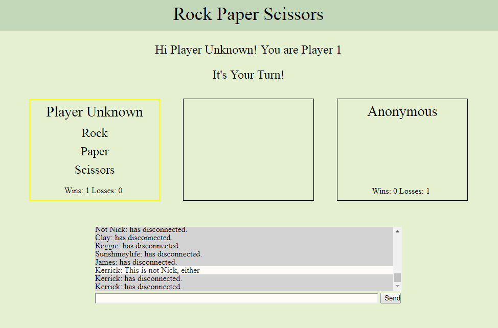
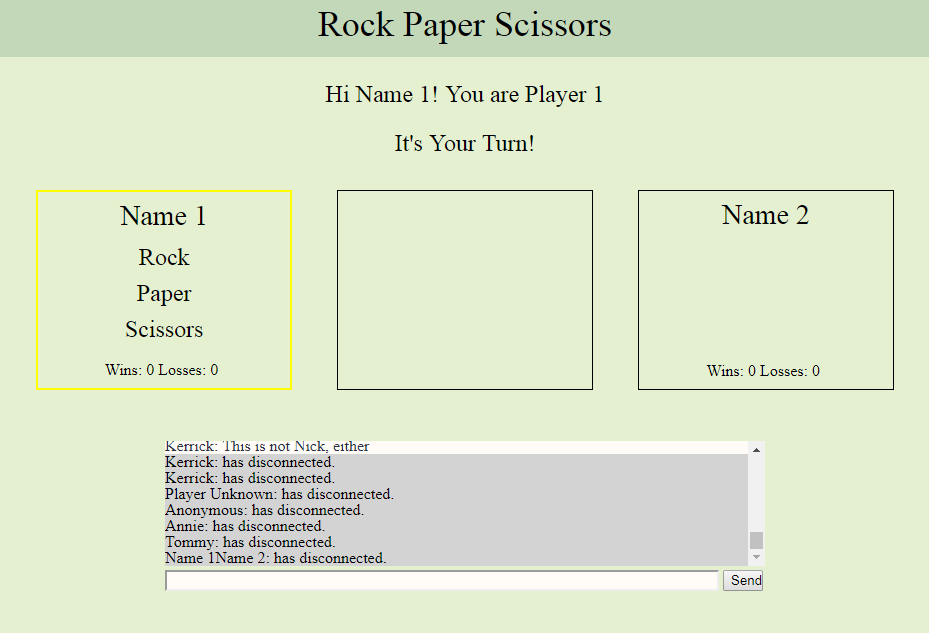

# RPS-Multiplayer

This application is an online multiplayer version of rock, paper, scissors - webchat included!

You and your opponent can face off on different screens with this app, taking turns selecting your move as you enter quick, witty banter in the chat.

Start by opening up this link https://kerrickwoyshner.github.io/RPS-Multiplayer/ in your browser, then click on the input box that says "Name".  Begin typing your username/nickname even if it appears that the application isn't typing.  Allow your partner to do the same, and in a couple moments your screen should look like the image below:

From here, Name 1 must click either Rock, Paper, or Scissors and wait until Name 2 does the same.  Once they've both made their choices, the application will decide a winner and begin the process over again, asking Name 1 to choose either Rock, Paper, or Scissors (see Player Unknown's options in the first image).

The application will tally up your wins and losses, but make sure to keep a running chart of your own back home - you'll want to keep playing this one over and over.

~KHW
